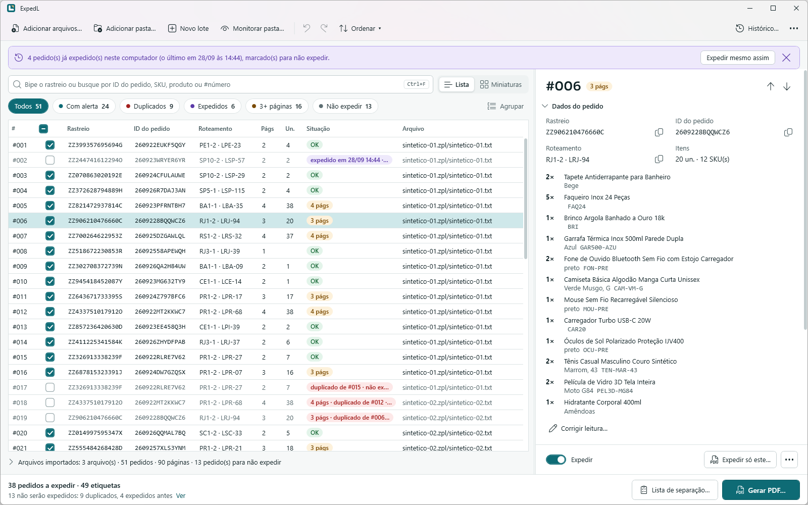
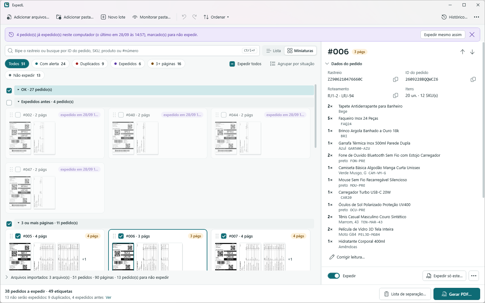
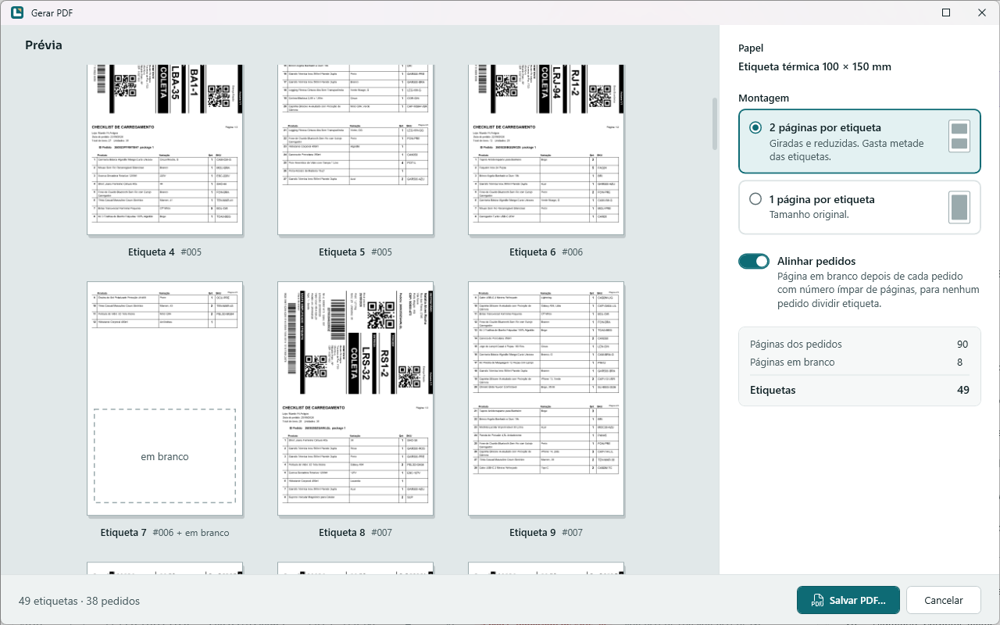
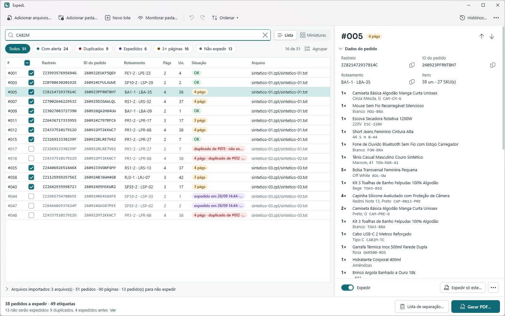
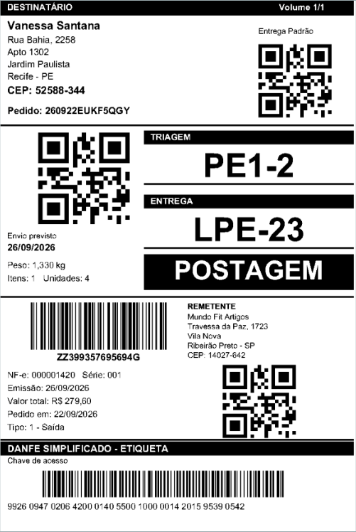
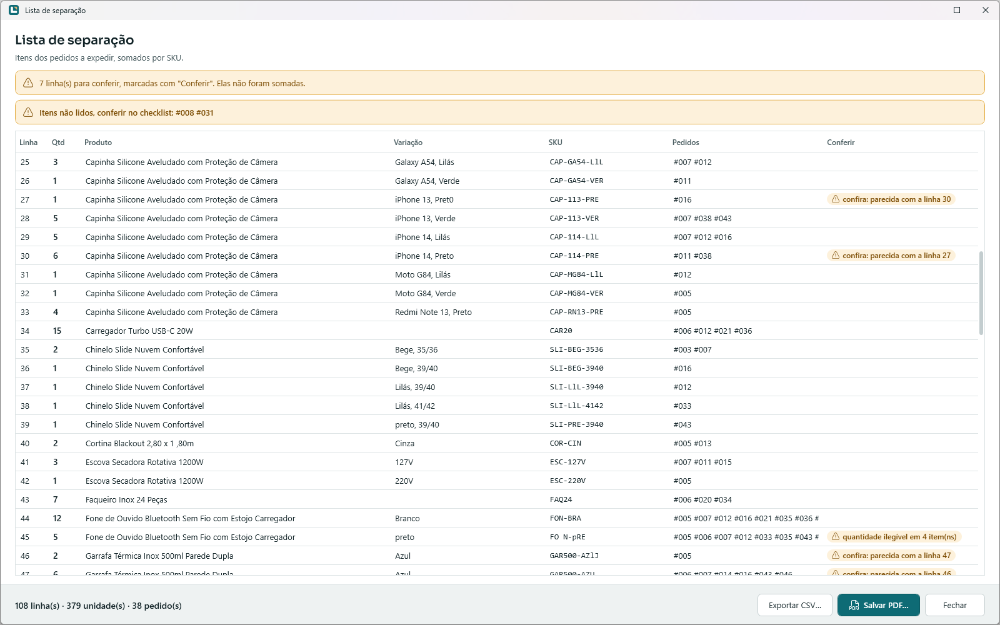

<div align="center">


# ExpedL

**Expedição sob controle.**

App para Windows que transforma os arquivos de etiqueta da Shopee em PDF pronto para a impressora térmica 4×6, organizado por pedido. Feito para lojas que despacham dezenas ou centenas de pedidos por dia.

[](https://github.com/gabreusi/expedl-releases/releases/latest/download/ExpedL.exe)

[](https://github.com/gabreusi/expedl-releases/releases)


Windows 10 ou 11, 64 bits · não pede administrador · [todas as versões](https://github.com/gabreusi/expedl-releases/releases)

<picture>
  <source media="(prefers-color-scheme: dark)" srcset="imagens/tela-principal-escuro.png">
  
</picture>

</div>

## O problema

Os arquivos de etiqueta costumam passar por um conversor online gratuito, sem prévia e sem edição. Os dados dos seus clientes vão parar num site de terceiros.

Quando um pedido tem 3 páginas, a impressão "2 por folha" desalinha tudo dali para frente, e alguém precisa calcular à mão onde recomeçar. E nada impede que o mesmo pedido saia duas vezes.

## O que muda com o ExpedL

### Os dados dos clientes ficam no computador

- O ExpedL não se conecta à internet. Não tem conta, nuvem nem telemetria.
- As etiquetas nunca saem do computador.
- O histórico guarda só o código de rastreio, a data e hora e o nome do PDF. Ele se apaga sozinho depois de 90 dias.

### Menos tempo

- Arraste o download em massa da Shopee para a janela. Num lote de 300 arquivos (600 páginas), a lista de pedidos aparece em menos de 3 segundos (medido num PC com 12 núcleos lógicos).
- Bipe o rastreio com o leitor de código de barras e o pedido fica selecionado. O próximo bipe já substitui a busca.
- Ordene o lote por produto ou SKU para que os pedidos do mesmo produto saiam juntos.
- A lista de separação soma os itens do lote por SKU. O separador pega tudo de uma vez.

### Menos erro

- Cada pedido tem um número no lote (#001, #002…), o mesmo na tela, no PDF e na lista de separação.
- Toda operação atua sobre o pedido inteiro, então etiqueta e checklist nunca se separam.
- Um pedido com 3 páginas ganha uma página em branco depois dele, e o seguinte começa no lugar certo.
- Pedido duplicado ou já expedido neste computador fica fora do PDF até alguém decidir.

### Menos etiqueta gasta

- Etiqueta e checklist saem juntos numa única etiqueta 4×6. Isso usa metade das etiquetas em relação a imprimir 1 página por etiqueta.
- Você imprime a 100%, 1 por folha, sem configurar "2 páginas por folha" no navegador ou na impressora.
- Os códigos de barras são redesenhados para continuar legíveis na página reduzida. Num teste com 50 pedidos, a chave da NF-e (código de barras de 44 dígitos) ficou legível em 50 de 50 etiquetas. No PDF de um conversor online gratuito, em 0 de 50.

## Como funciona

### 1. Importe

Arraste arquivos ou pastas para a janela, use "Adicionar arquivos…" (Ctrl+O) ou cole com Ctrl+V.

### 2. Confira

A lista mostra os pedidos, os filtros e os destaques do que pede decisão. O resumo, no formato "50 pedidos a expedir · 51 etiquetas", fica sempre à vista.



### 3. Gere o PDF

Veja a prévia de todas as etiquetas ao lado das opções e salve. Logo depois de salvar, os pedidos já ficam marcados como expedidos.



## Todos os recursos

<details>
<summary>Importar</summary>

- Arraste e solte arquivos e pastas, use o botão "Adicionar arquivos…" (Ctrl+O) ou cole (Ctrl+V).
- Aceita .zpl, .zip, .txt e .prn. Reconhece a etiqueta pelo conteúdo, não pela extensão, e aceita o download em massa da Shopee direto.
- Você pode adicionar mais arquivos a um lote já aberto.
- O mesmo arquivo importado duas vezes é ignorado, com aviso.
- Pasta monitorada (opcional): o app vigia uma pasta, como Downloads, e os arquivos de etiqueta novos entram sozinhos no lote.
- A leitura dos textos continua em segundo plano, sem travar a tela.

</details>

<details>
<summary>Conferir</summary>

- O pedido é a unidade de trabalho, com o mesmo número (#001, #002…) na tela, no PDF e na lista de separação.
- À esquerda fica a lista de pedidos, em lista ou em miniaturas. À direita, o pedido selecionado, com as páginas e o que vai acontecer com ele na montagem.
- Filtros com contagem e agrupamento por arquivo, por situação ou por roteamento. Cada grupo mostra o nome, a quantidade de pedidos e uma caixa para marcar ou desmarcar o grupo inteiro para expedir. Os grupos recolhem e abrem com um clique.
- Destaques para pedido duplicado, pedido expedido antes, pedido com 3 ou mais páginas e leitura incerta.
- Tema claro, escuro ou o do Windows. O app respeita o alto contraste e a opção "Mostrar animações" do Windows.
- Janelas no estilo do Windows 11, com os botões da barra de título e o Snap Layouts.

</details>

<details>
<summary>Ler os dados da etiqueta</summary>

- O app lê o ID do pedido, o roteamento (as duas caixas pretas da etiqueta) e os itens do checklist: produto, variação, SKU e quantidade. A leitura é feita pelo próprio Windows, sem internet.
- Avisa quando o ID do pedido no checklist não bate com o da etiqueta.
- Você pode corrigir à mão uma leitura errada. A correção vale para a tela, a busca, a ordenação e a lista de separação. A etiqueta impressa nunca muda, porque é a imagem original da Shopee.
- O painel de dados do pedido tem botão de copiar. O que você copia fica fora do histórico da área de transferência do Windows (Win+V) e da sincronização com a nuvem.

</details>

<details>
<summary>Buscar e reimprimir</summary>

- Uma caixa de busca (Ctrl+F) acha o pedido pelo código de rastreio, #número, ID do pedido, SKU, produto ou variação. Ignora maiúsculas, acentos, espaços e hífens.
- Com leitor de código de barras: bipou o rastreio, o pedido é selecionado, e o próximo bipe já substitui a busca.
- Etiqueta perdida ou estragada? Reimprima só aquele pedido em um clique.



</details>

<details>
<summary>Organizar</summary>

- Reordene pedidos arrastando ou pelo teclado (Alt+↑ / Alt+↓), remova um pedido cancelado (Del) ou insira uma página em branco.
- Desfazer e refazer com Ctrl+Z e Ctrl+Y.
- Ordene o lote por produto/SKU, por roteamento ou pela ordem original.

</details>

<details>
<summary>Gerar o PDF</summary>

- Alinhamento automático: cada pedido ocupa um número par de páginas. Um pedido de 3 páginas ganha uma página em branco depois dele.
- Montagem de 2 páginas por etiqueta (padrão), com etiqueta e checklist na mesma etiqueta 4×6, impressa a 100%, 1 por folha. A montagem de 1 página por etiqueta continua disponível.
- Os códigos de barras são redesenhados com barras de largura exata quando a página é reduzida.
- O PDF abre o diálogo de impressão a 100% nos leitores que respeitam essa opção.
- O nome do arquivo é automático, começa pela data e não tem dados pessoais. Exemplo: `2026-09-26_lote03_150pedidos_2-por-etiqueta.pdf`.



</details>

<details>
<summary>Não imprimir duas vezes</summary>

- O mesmo pedido (mesmo código de rastreio) vindo de arquivos diferentes é marcado como duplicado e fica fora do PDF até alguém decidir.
- O pedido que já foi para um PDF neste computador aparece como "expedido", com data e hora, e fica fora do próximo PDF. Para reimprimir de propósito, há o botão "Expedir mesmo assim".
- Os pedidos ficam marcados como expedidos logo depois de salvar o PDF. Gerar de novo na mesma hora não duplica.
- Fechar o app com pedidos que ainda não foram para um PDF pede confirmação.
- Se o computador desligar ou o app fechar de repente, na próxima abertura ele oferece restaurar o lote. Para isso, relê os arquivos originais, sem guardar etiquetas em disco.

</details>

<details>
<summary>Lista de separação</summary>

- A partir dos checklists, o app gera uma lista consolidada por SKU: produto, variação, quantidade total no lote e os números # dos pedidos que têm aquele item.
- Linhas que podem ser o mesmo item com erro de leitura ficam marcadas "confira" e nunca são somadas sozinhas. Variações legítimas, como tamanhos P, M, G e GG ou itens com SKUs diferentes, não são marcadas.
- Sai em etiquetas 4×6, na mesma impressora térmica, ou em CSV que o Excel abre direto. Não leva dados de destinatário.



</details>

## Privacidade e segurança

Para quem cuida da LGPD e dos computadores da empresa.

O que o ExpedL nunca faz:

- Não se conecta à internet, em nenhum momento. Não tem telemetria, conta nem nuvem.
- Não envia as etiquetas para fora do computador.
- Não grava nomes, endereços ou conteúdo das etiquetas nos registros (logs). Eles guardam só contagens e erros.
- Não pede administrador, nem para instalar, nem para usar.

O que ele guarda, e como:

- O histórico guarda só o código de rastreio, a data e hora e o nome do PDF. Ele fica cifrado com a DPAPI (a proteção de dados do Windows) do usuário e se apaga sozinho depois de 90 dias. O prazo é configurável.
- Os arquivos temporários ficam numa pasta própria do app e são apagados ao fim de cada lote e ao abrir o app.
- A leitura dos textos da etiqueta usa o OCR (reconhecimento de texto) do próprio Windows, offline.
- O arquivo de etiqueta é tratado como entrada não confiável, com limites de tamanho e proteção contra ZIP malicioso.
- O feedback sai pelo programa de e-mail do próprio usuário. Antes de enviar, o app mostra tudo o que vai na mensagem e avisa para não mandar dados de clientes.
- O app usa só componentes de código aberto com licença permissiva. Os textos completos estão na tela "Sobre".

## Download e instalação

1. Baixe o [`ExpedL.exe`](https://github.com/gabreusi/expedl-releases/releases/latest/download/ExpedL.exe). As versões anteriores ficam na [página de versões](https://github.com/gabreusi/expedl-releases/releases).
2. Se quiser, confira o arquivo. Cada versão traz um `SHA256SUMS.txt`. No PowerShell, na pasta onde está o arquivo, rode:

   ```powershell
   Get-FileHash .\ExpedL.exe -Algorithm SHA256
   ```

   O valor mostrado precisa ser igual ao do `SHA256SUMS.txt`.
3. Abra o `ExpedL.exe`. Se o Windows mostrar um aviso, veja a seção seguinte.
4. O mesmo arquivo roda direto, como versão portátil, e também oferece se instalar para o seu usuário, com atalho no menu Iniciar e entrada em "Aplicativos instalados". Na desinstalação, o app pergunta se apaga também os dados.
5. Na primeira abertura, leia e aceite os Termos de Uso e a Política de Privacidade.

### Aviso do Windows (SmartScreen)

O `ExpedL.exe` ainda não tem assinatura digital. Por isso, na primeira abertura de cada versão baixada, o Windows pode mostrar a mensagem "O Windows protegeu o computador".

Para abrir:

1. Clique em **Mais informações**.
2. Clique em **Executar assim mesmo**.

Outro caminho é clicar com o botão direito no arquivo › Propriedades › marcar "Desbloquear" › OK.

O aviso não aparece quando o arquivo é copiado por pen drive ou pela rede local. Para ter certeza de que o arquivo é o mesmo publicado aqui, confira o SHA-256 antes de abrir (passo 2).

## Requisitos

- Windows 10 ou 11, 64 bits.
- Nada para instalar antes. O runtime (os componentes de que o app precisa para rodar) já vai dentro do executável.
- Não pede administrador.
- Impressão pensada para impressora térmica de 203 dpi com etiqueta 4×6 (100×150 mm).
- OCR do Windows em português para ler os textos da etiqueta. Um Windows instalado em português normalmente já traz esse recurso. Sem ele, ficam de fora o ID do pedido, o roteamento, os itens, a ordenação por produto, a lista de separação e a busca por SKU. O resto do app funciona normalmente.

## Teste grátis e licença

Sem chave, você pode importar, conferir, organizar, buscar e ver o histórico. **Gerar o PDF, reimprimir e gerar a lista de separação pedem uma chave.**

Para pedir a chave de teste gratuita:

1. No ExpedL, abra **Sobre › Ativar licença…**.
2. Copie o código do computador.
3. Envie o código para [contact@gabreusi.dev](mailto:contact@gabreusi.dev).

A chave de teste tem prazo e é emitida para aquele computador.

A licença definitiva é por computador e não tem prazo de uso. Você paga uma vez, sem mensalidade, e a chave funciona offline. Ela cobre as versões lançadas até a data indicada na chave, e renovar as atualizações depois disso é opcional. Preço e forma de pagamento são informados por e-mail, antes da compra. Para trocar de computador, é preciso pedir uma chave nova.

## Perguntas frequentes

<details>
<summary>Precisa de internet?</summary>

Não. O ExpedL não se conecta à internet em nenhum momento, e a chave de licença também funciona offline.

</details>

<details>
<summary>O app manda meus dados ou os dos meus clientes para algum lugar?</summary>

Não. As etiquetas nunca saem do computador, e não há telemetria, conta nem nuvem. O feedback só sai se você enviar, pelo seu próprio e-mail. Detalhes em [Privacidade e segurança](#privacidade-e-segurança).

</details>

<details>
<summary>Funciona com a minha impressora?</summary>

O PDF foi pensado para impressora térmica de 203 dpi com etiqueta 4×6 (100×150 mm). Antes de comprar, use a chave de teste para imprimir um lote na sua impressora.

</details>

<details>
<summary>Funciona com etiquetas de outros marketplaces?</summary>

Hoje, não. O ExpedL entende só etiquetas da Shopee.

</details>

<details>
<summary>Por que o Windows mostra um aviso ao abrir?</summary>

Porque o executável ainda não tem assinatura digital. Veja os passos em [Aviso do Windows (SmartScreen)](#aviso-do-windows-smartscreen).

</details>

<details>
<summary>Preciso ser administrador do computador?</summary>

Não, nem para instalar, nem para usar.

</details>

<details>
<summary>Posso usar em mais de um computador?</summary>

A licença é por computador, então cada um precisa da sua chave. Trocar de computador exige pedir uma chave nova.

</details>

<details>
<summary>E se o computador desligar no meio do lote?</summary>

Na próxima abertura, o ExpedL oferece restaurar o lote. Ele relê os arquivos originais, sem ter guardado etiquetas em disco.

</details>

## Suporte e contato

Dúvidas, problemas e pedidos de chave: [contact@gabreusi.dev](mailto:contact@gabreusi.dev). Ao escrever, não anexe etiquetas nem dados de clientes.

O ExpedL é desenvolvido por Gabriel Pantano Signorini (gabreusi).

---

Os Termos de Uso e a Política de Privacidade aparecem no app na primeira abertura, para leitura e aceite. <!-- TODO: link para os termos quando houver cópia pública -->

Shopee é marca de seus respectivos donos. O ExpedL não é afiliado à Shopee nem endossado por ela.
